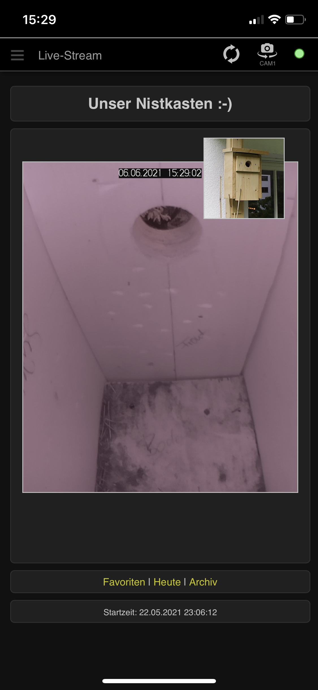
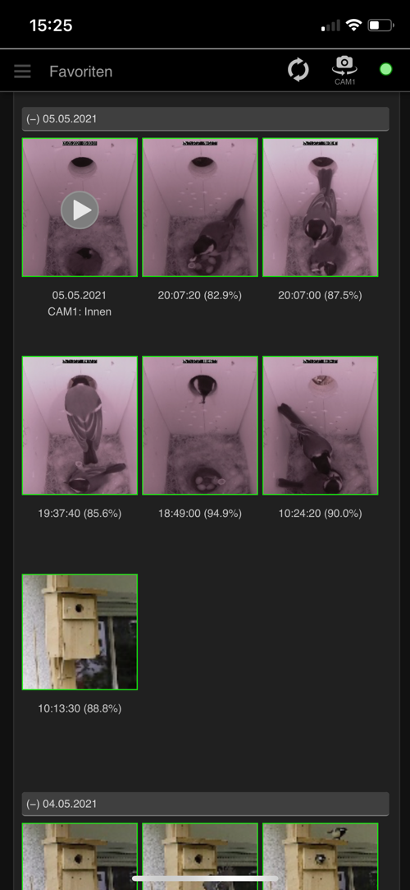
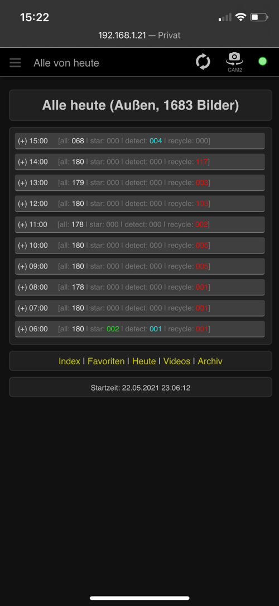

# Birdhouse Camera

Raspberry Pi project to observe our birdhouse with multiple webcams (live stream, record images and videos, 
mark favorites ...).

## Birdhouse Construction

* German instructions: [NABU - Nistkästen selber bauen](https://www.nabu.de/tiere-und-pflanzen/voegel/helfen/nistkaesten/index.html)
* English instructions: [Simple birdhouse](https://suncatcherstudio.com/birds/birdhouse-plans-simple/)

## Main Software Features

* Use as web-app on an iPhones or in a browser
* Watch **live stream** with 1-2 cameras 
  * via Raspberry Pi camera
  * USB web cam (e.g. RPi cam inside and USB web cam outside)
* **Record photos**
  * e.g. every 20 seconds (configurable in data/config.json)
  * Similarity detection, filter photos with movement in a defined area
* **Manage photos**
  * Mark photos and videos as favorites and to be deleted
  * Mark a range of photos between two marked photos as to be deleted
  * List favorite photos and videos in a list
  * Delete marked photos
  * Archive photos with movement and favorite photos once a day
* **Record and stream videos**
  * create mp4 video, works with iOS devices
  * Create video from all pictures of the current day
  * Trim videos
* Get, archive, and visualize **weather data**:
  * from sensors connected to the Raspberry Pi (DHT11/DHT22)
  * via internet for a defined location (python_weather)
* Connect to **audio stream** from microphone
  * under construction, currently browser only (no iPhone)
* **Admin functionality** via app
  * Deny recording and admin functionality for specific IP addresses (e.g. router or proxy, to deny for access from the internet)
  * edit server settings
  * edit device settings (devices must be added via config file)

## Technology

* Raspberry Pi 3B+ (or newer)
* Camera module for RPi / HD with IR sensor
* USB camera
* Small USB Microphone
* DHT11 / DHT22 Sensor
* Python 3, PiCamera, CV2, imutils, JSON, Flask, python_weather, ...
* HTML, CSS, JavaScript, Pinch-Zoom, ffmpeg 
* jc://modules/, jc://app-framework/

## Installation

* Build a birdhouse incl. a Raspberry Pi or USB Camera inside the birdhouse (additional cameras and sensors are optional)
* Prepare a Raspberry Pi 3B or newer
  * Install a fresh image on an SDCard (https://www.raspberrypi.com/software/)
  * Recommend OS: Ubuntu 22.04 (32bit) Server OS
  * Install git: ```sudo apt-get install git```
  * Install raspi-config: ```sudo apt-get install raspi-config```
  * Install v4l2-ctl: ```sudo apt-get install v4l-utils```
  * Create and move to your project directory (e.g. /projects/prod/)
* Install software as docker version or directly
* Connect camera (and optional devices) with the Raspberry, start and enjoy

_NOTE: For an upgrade of an existing older version from v0.x to v1.x it is required
to rename (or remove) the file 'data/config.json' and restart after the update. 
Then change the new default configuration to your needs ..._

### Clone sources to your project directory

```bash 
$ git clone http://github.com/jc-prg/birdhouse-cam.git
$ cd birdhouse-cam
$ git submodule update --init --recursive
```

### Install as Docker version (under construction)

* Install docker and docker-compose
```bash
$ sudo ./config/install/install_docker
```

* Create configuration and edit (if required)
```bash
$ sudo cp sample.env .env
$ sudo nano .env
```

* Build docker container and run the first time
```bash
$ docker-compose up --build
```
* Add the following lines to crontab (start on boot):
```bash 
@reboot /usr/sbin/docker-compose -f /<path_to_script>/docker-compose.yml up -d
```

### Install directly

* Install birdhouse-cam:
```bash 
# Install required Python modules and ffmpeg (this may take a while)
$ sudo ./config/install/install
$ sudo ./config/install/install_ffmpeg

# Initial start, will create a config file
$ ./server/server.py
```
* Add the following lines to crontab (start on boot):
```bash 
@reboot /usr/bin/python3 /<path_to_script>/server/server.py --logfile
@reboot /usr/bin/python3 /<path_to_script>/server/stream_video.py
```
### First run and device configuration

* Open your client (usually via http://your-hostname:8000/). 
When you run it the first time you'll be asked to check, change and save the settings.
After that open the device settings, check and save them also.
* NOTE: if you want to add devices at the moment you have to edit the config file directly. 
It's stored as ./data/config.json.

### Add audio streaming (under construction, not running on iOS devices yet)

* To start the audio streaming edit and link the file [stream.service](config/install/stream.service) to the folder /etc/systemd/systems and start as root (see instructions in the file):

``` bash
$ systemctl start stream.service
```

### Optimize system configuration (Ubuntu 22.04)

* Update swap memory (see also [https://bitlaunch.io/](https://bitlaunch.io/blog/how-to-create-and-adjust-swap-space-in-ubuntu-20-04/))

```commandline
free -h
fallocate -l 2G /swapfile
chmod 600 /swapfile
mkswap /swapfile
swapon /swapfile
free -h
```

### Optimize system configuration (Raspbian / Raspberry OS)

* Update swap memory (usually 100MiB is set as default)
```
$ sudo nano /etc/dphys-swapfile

# change the following values to:
CONF_SWAPSIZE=
CONF_SWAPFACTOR=2

$ sudo systemctl restart dphys-swapfile
```

### Helping stuff

* Check attached cameras

```bash
# list video devices (install: apt-get install v4l2-ctl) 
$ v4l2-ctl --list-devices

# check available cameras
$ vcgencmd get_camera

# check available audio devices
$ arecord -l

# set audio level
amixer -c 2 -q set 'Mic',0 100%
```


## Sources

Thanks for your inspiration, code snippets, images:

* [https://github.com/Freshman-tech/custom-html5-video](https://github.com/Freshman-tech/custom-html5-video)
* [https://github.com/manuelstofer/pinchzoom](https://github.com/manuelstofer/pinchzoom)
* [https://gifer.com/en/ZHug](https://gifer.com/en/ZHug)
* [https://github.com/szazo/DHT11_Python](https://github.com/szazo/DHT11_Python)
* [https://github.com/bullet64/DHT22_Python](https://github.com/bullet64/DHT22_Python)
* [https://www.tunbury.org/audio-stream/](https://www.tunbury.org/audio-stream/)

## Impressions


<br/><br/>

<br/><br/>




<br/><br/>

