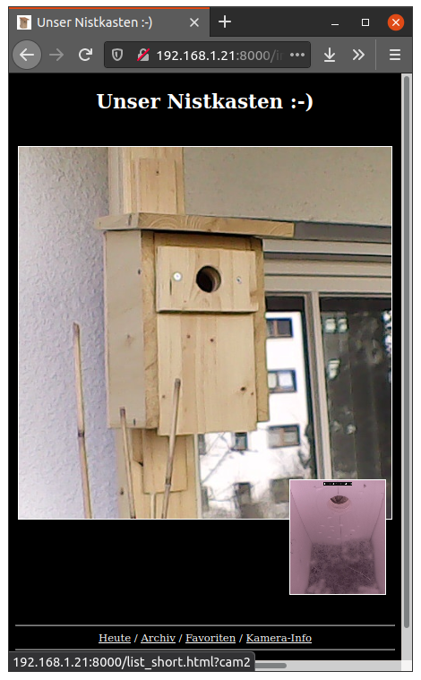
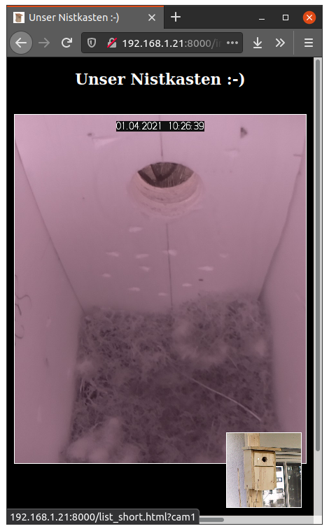
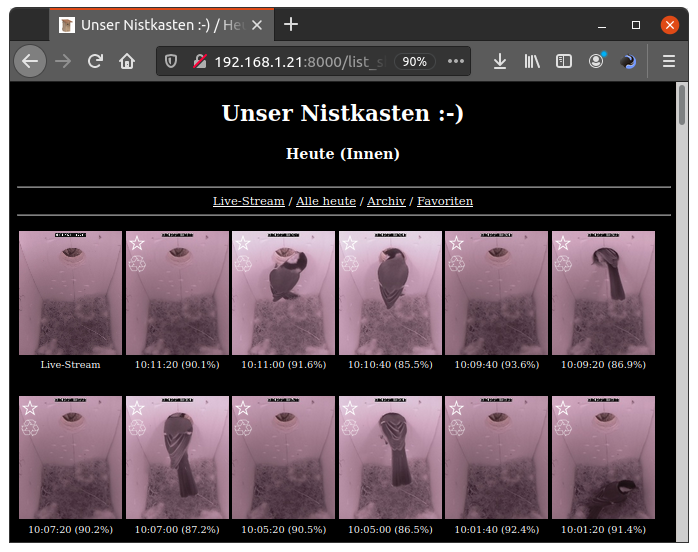
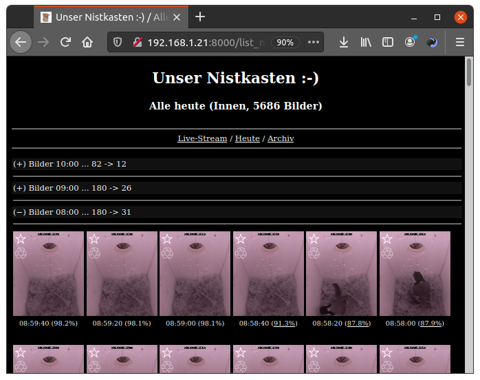
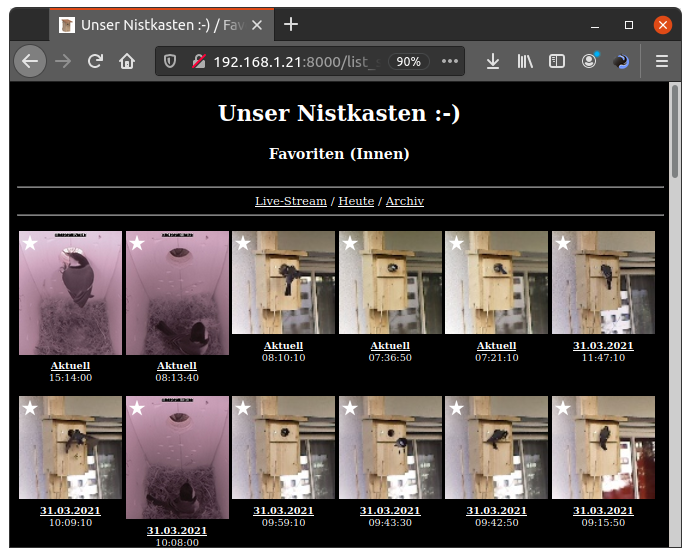

# Birdhouse Camera
Raspberry Pi project to observe our birdhouse with multiple webcams (live stream, record images, ...)

## Features

* Watch live stream via Raspberry Pi camera and USB web cam (e.g. RPi cam inside and USB web cam outside)
* Record photos e.g. every 20 seconds
* Similarity detection, filter photos with movement in a defined area
* Mark photos as favorits, show a list of all favorit photos
* Mark photos as to be deleted / not to be archived
* Archive photos with movement and favorit photos once a day
* Record and stream videos (including to iOS devices)

## Technology

* Raspberry Pi 3B
* Python 3, PiCamera, CV2, imutils, JSON, Flask
* HTML, CSS, JavaScript

## Installation

* Prepare a Raspberry Pi 3B or new with the latest version of Rasbian
* Ensure Python 3 is installed
* Install git: ```bash sudo apt-get install git ```
* Install birdhouse-cam:
```bash 
# Get source code
$ git clone http://github.com/jc-prg/birdhouse-cam.git
$ cd birdhouse-cam

# Install required Python modules and ffmpeg
$ info/install
$ info/install_ffmpeg

# Initial start -> check via http://<your-ip-address>:8000/ and stop via <Ctrl>+<C>
$ ./stream.py

# Edit config file
$ nano config.json
```
* Add the following lines to crontab (start on boot):
```bash 
@reboot /usr/bin/python3 /<path_to_script>/stream.py --logfile
@reboot /usr/bin/python3 /<path_to_script>/videostream.py
```

## Impressions






