# Birdhouse Camera v1.0.8 (in progress)

Raspberry Pi project to observe our birdhouse with two webcams: live stream, record images, 
detect activity, detect birds, record videos, mark favorites, analyze weather data, 
app in English and German, ...

1. [Impressions](#impressions)
2. [Main Features](#main-features)
3. [Birdhouse](#birdhouse)
4. [Technology](#technology)
5. [Installation](#installation)
   * [Getting sources](#getting-sources)
   * [Software installation](#software-installation)
   * [First run and device configuration](#first-run-and-device-configuration)
   * [Finalize database setup](#finalize-database-setup)
   * [Accessing images via WebDAV](#Accessing-images-via-WebDAV)
   * [Optimizing system configuration](#optimizing-system-configuration)
   * [Sample proxy server configuration](#Sample-proxy-server-configuration)
6. [Train bird detection](#Train-bird-detection)
7. [Helping stuff](#helping-stuff)
8. [Other sources](#other-sources)


## Impressions

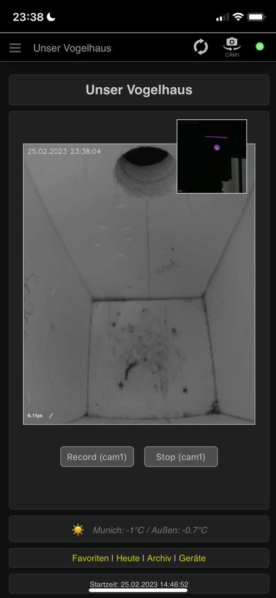
<br/><br/>
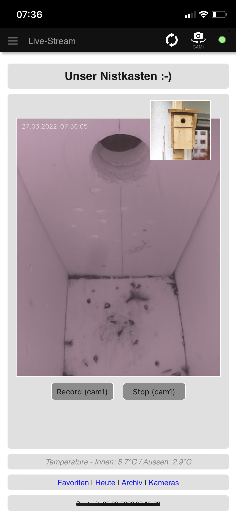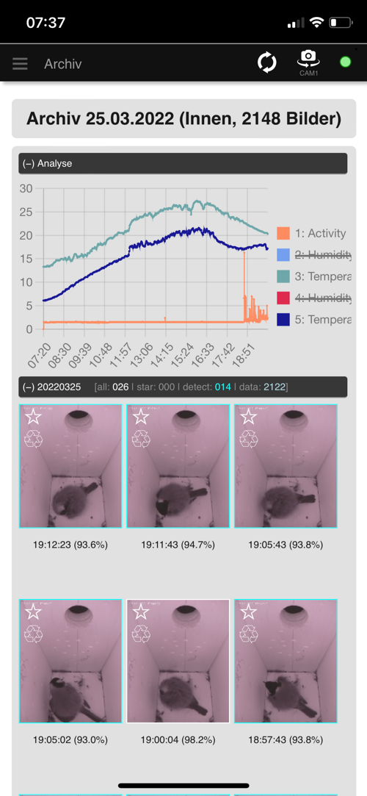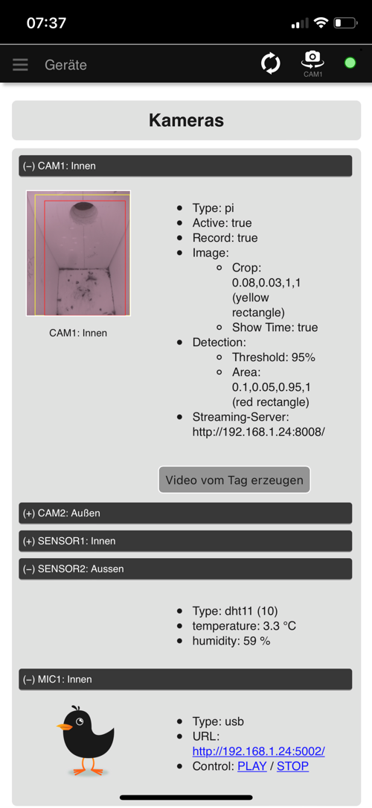
<br/><br/>
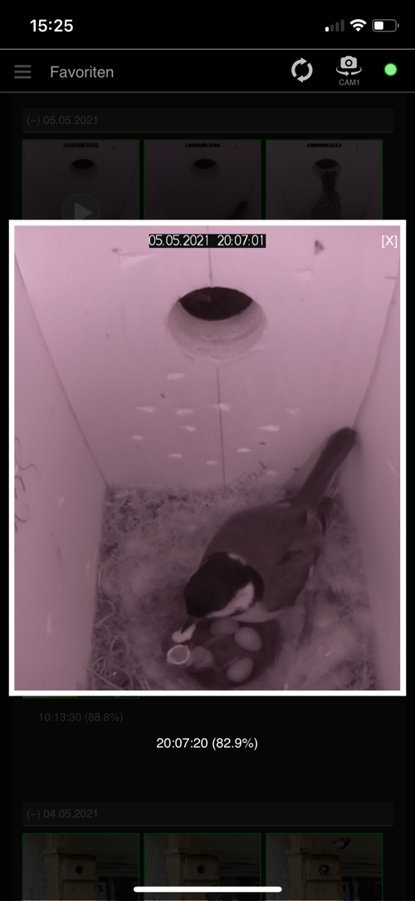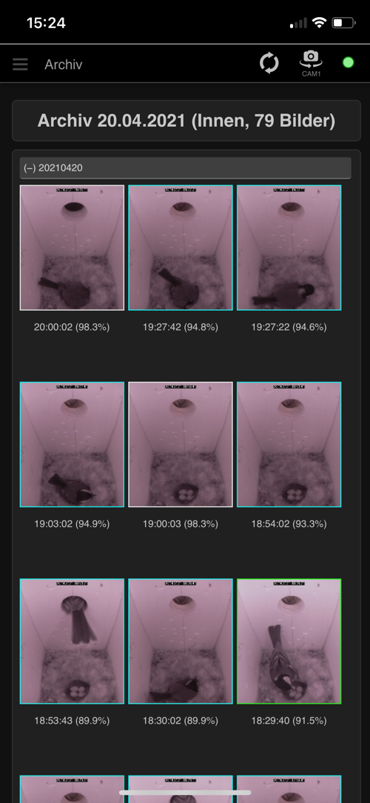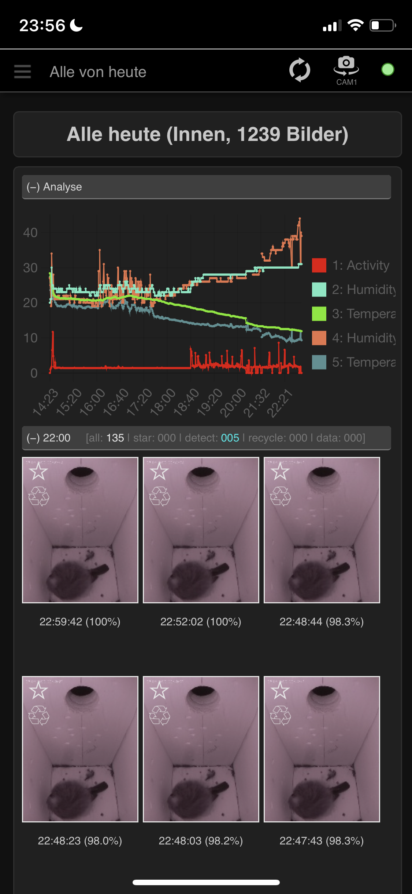


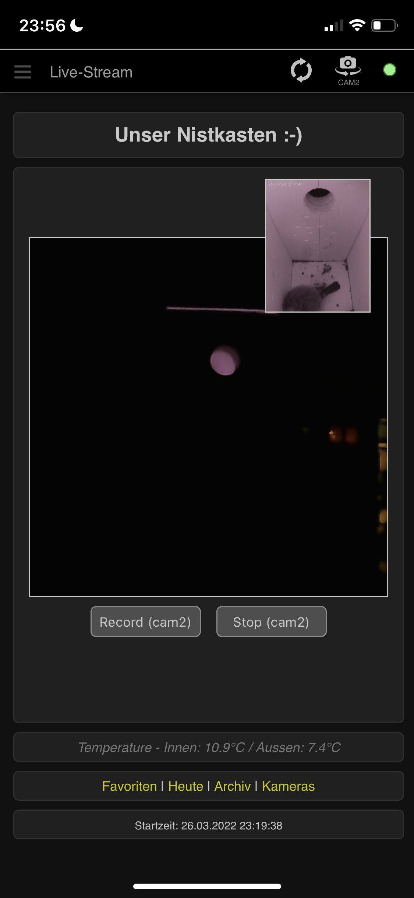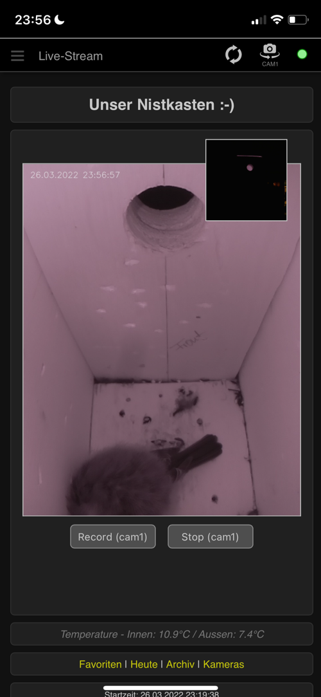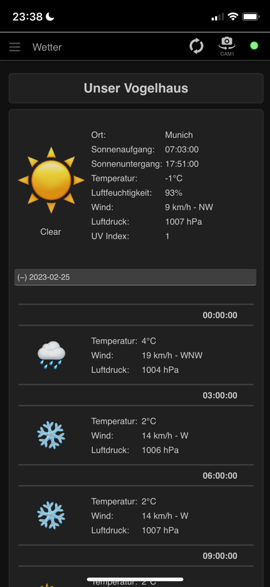

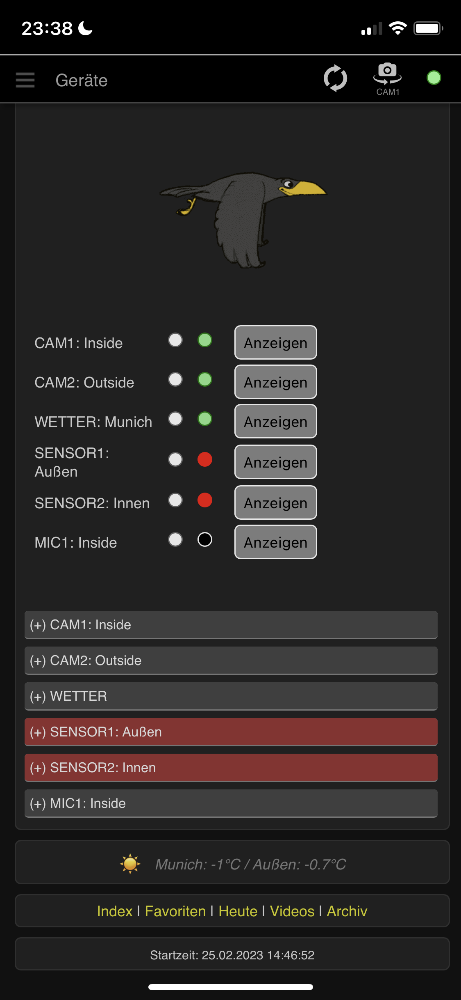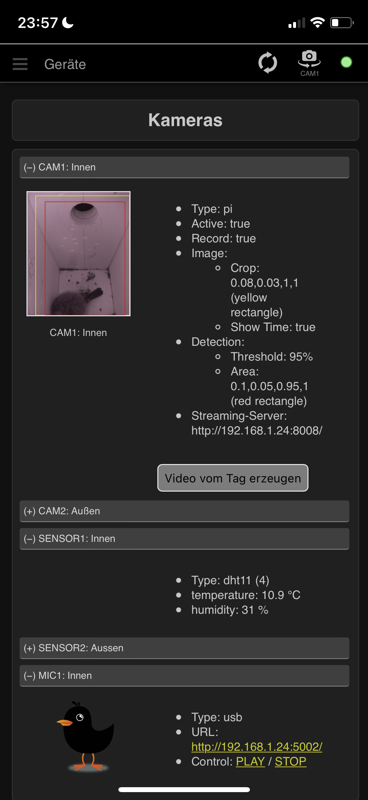

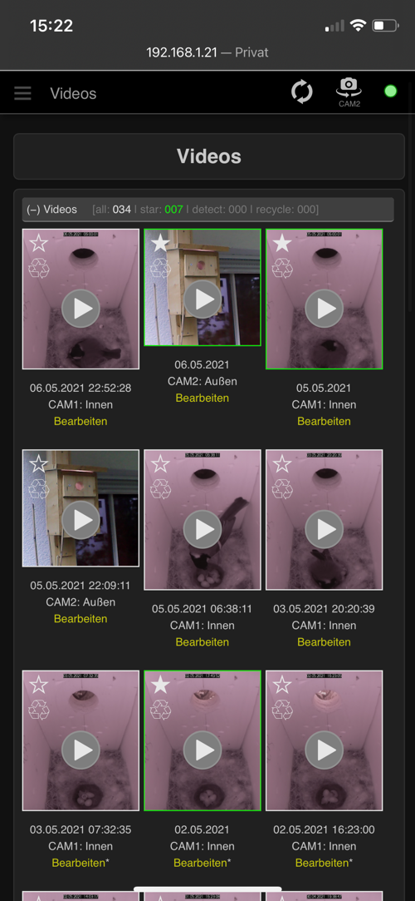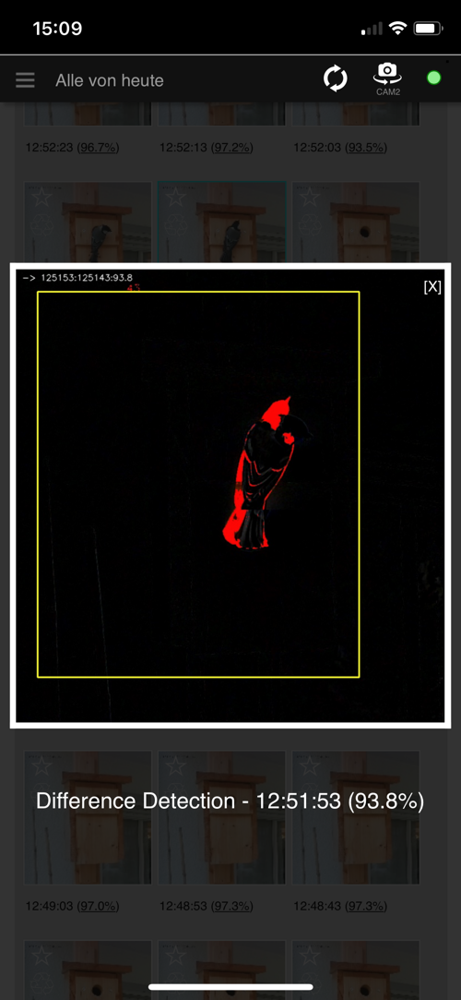

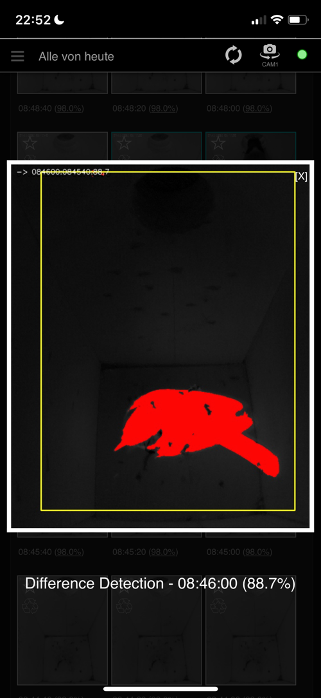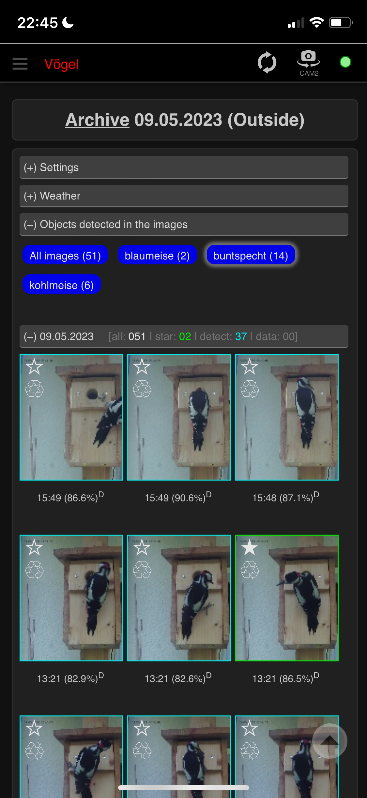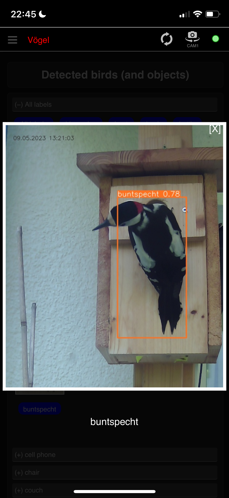

<br/><br/>
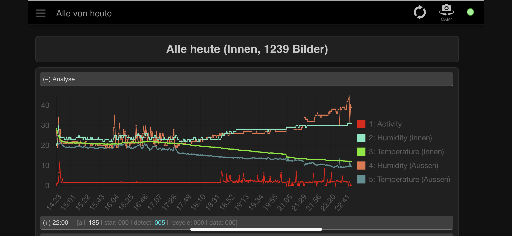

## Main Features

* **WebApp for Browser and SmartPhone** (English and German, optimized for iPhone)
* **Watching live stream** with 1 or 2 cameras (RPi4 recommend for fluent stream) 
  * via Raspberry Pi camera
  * USB web cam (e.g. RPi cam inside and USB web cam outside)
* **Continuously recording photos**
  * e.g. every 20 seconds from sunrise to 20:00 local time (configurable in the device settings)
  * Similarity detection, filter photos with movement in a defined area (visualize differences)
  * camera and image settings configurable (brightness, contrast, ...)
* **Managing photos and videos**
  * Mark photos and videos as favorites or to be deleted
  * Mark a range of photos between two marked photos as to be deleted
  * List favorite photos and videos
  * Delete marked photos
  * Archive photos with movement and favorite photos once a day
* **Recording and streaming videos**
  * create mp4 video incl. audio, works with iOS devices
  * Create video from all pictures of the current day
  * Trim videos
* **Recording and visualizing weather data**:
  * via internet for a defined location (python_weather OR [Open Meteo](https://open-meteo.com/))
  * from sensors connected to the Raspberry Pi (DHT11/DHT22)
  * GPS lookup for cities or addresses via GeoPy to set weather location
* **Listening audio stream** from microphone
  * under construction, currently browser only (no iPhone)
* **Detecting birds** (objects) via PyTorch
  * bird detection model in an early stage trained with a few European singing birds
  * view with all detected birds and objects -> jump to other views filtered by bird
  * filter by detected birds in archive and favorite view as well as for admins in complete view of current day
  * batch detection for archive images
  * _live detection is experimental and slow on RPi 4 (admin view)_
  * _no label editing via app yet_
* **Admin functionality** via app
  * Deny recording and admin functionality for specific IP addresses (e.g. router or proxy, to deny for access from the internet) or use password to login as administrator
  * edit server settings (partly, other settings define in file .env)
  * edit device settings, reconnect devices (devices must be added via config file)
  * edit camera and image settings (contrast, saturation, hue, brightness ...)
  * see amount of currently active streams
  * download archived data (hires, config-files, object detection as YOLOv5)

## Birdhouse

Here are some options. Calculate with a little bit more space in the height for the camera inside the birdhouse.

* German instructions: [NABU - Nistkästen selber bauen](https://www.nabu.de/tiere-und-pflanzen/voegel/helfen/nistkaesten/index.html)
* English instructions: [Simple birdhouse](https://suncatcherstudio.com/birds/birdhouse-plans-simple/)

## Technology

* IT Hardware
  * Raspberry Pi 3B+, Raspberry Pi 4 (recommended)
  * Micro SD with 64 GByte
  * USB camera for outside view (and maybe inside view)
  * _optional:_ PiCamera with IR for the inside view (wide-angle, e.g., 110°)
  * _optional:_ Small USB Microphone
  * _optional:_ DHT11 / DHT22 Sensor
* Software
  * Python 3, CV2, JSON, Flask, ffmpeg, ffmpeg-progress, PyAudio, PyTorch/YOLOv5
  * python_weather, Weather by [Open-Meteo.com](https://open-meteo.com/), GeoPy
  * HTML, CSS, JavaScript, Pinch-Zoom
  * jc://modules/, jc://app-framework/

## Installation

* Build a birdhouse incl. a Raspberry Pi or USB Camera inside the birdhouse (additional cameras and sensors are optional)
* Prepare a Raspberry Pi 3B or newer
  * Install a fresh image on an SDCard (https://www.raspberrypi.com/software/)
  * Recommended OS (due to restrictions: PyTorch require 64bit, picamera doesn't support 64bit any more, 
    and picamera2 + libcamera doesn't work in docker container yet (requires Raspbian OS 64bit > bullseye)) 
    * Raspbian OS Lite 64bit for **object detection** using PyTorch
    * Raspbian OS Lite 32bit if you want to use a **PiCamera**  
      
  * Install git: ```sudo apt-get install git```
  * _Optional:_ Install v4l2-ctl: ```sudo apt-get install v4l-utils```
  * Create and move to your project directory, e.g., /projects/test/ or /projects/prod/ 
* Choose one of the installation procedures below depending on your needs 
* Connect cameras (and optional devices) with the Raspberry, start and enjoy

_NOTE: For an upgrade of an existing older version it might be required
to rename (or remove) the files 'data/config.json' and '.env' and restart after the update. 
Then change the new default configuration to your needs ..._

### Getting sources

```bash 
$ git clone http://github.com/jc-prg/birdhouse-cam.git
$ cd birdhouse-cam
$ git submodule update --init --recursive
```

### Software installation

Depending on the needs there are three options available how to install and run this software:

*  [(1) Docker based installation](#1-docker-based-installation) - the easiest way to install and run the birdhouse-cam, 
  but with limitations: you have to decide if you want to use a PiCamera on a 32bit OS or 
  object detection with 64bit OS.
* [(2) Direct installation](#2-direct-installation) - complete installation of all components with a bigger effort but without the limitations of (1)
* [(3) Hybrid installation](#3-hybrid-installation) - combination with less effort than (2) and without the limitations
  of (1), recommend if you want to use PiCamera and object detection

#### (1) Docker based installation

1. Install docker and docker-compose
    ```bash
    $ sudo ./config/install/install_docker
    ```
2. Create and adapt main configuration file, see [sample.env](sample.env) for details and ensure 
   the right settings especially regarding the directories, the container images and the rpi_* settings
    ```bash
    $ sudo cp sample.env .env
    $ sudo nano .env
    ```
3. Build docker container and run the first time
    ```bash
    $ docker-compose up --build
    ```
4. Initial start to create a config file, see [First run and device configuration](#First-run-and-device-configuration)
5. Add the following lines to crontab (start on boot):
    ```bash 
    @reboot /usr/sbin/docker-compose -f /<path_to_script>/docker-compose.yml up -d
    ```
6. Examine logging messages if there are any problems
   ```bash
   # show complete log file
   $ cat log/server.log
   
   # show latest log messages with an update every 2s
   $ ./watch_log
   ```

#### (2) Direct installation

_Note:_ This installation is not fully tested yet. Recommend are (1) and (3).

1. Install birdhouse-cam prerequisites
    ```bash 
    # Install required Python modules and ffmpeg (this may take a while)
    $ sudo ./config/install/install       # for installation on x86
    $ sudo ./config/install/install_rpi   # for installation on Raspberry Pi
                                          # $ sudo ./config/install/install_ffmpeg
    ```
2. _Optional:_ Install CouchDB (no installation script available) or use JSON files as database
3. Create and adapt main configuration file, see (1.2)
4. Initial start to create a config file, see [First run and device configuration](#First-run-and-device-configuration)
    ```bash 
    # Initial start, will create a config file
    $ ./server/server.py
    ```
5. Add the following lines to crontab (start on boot)
    ```bash 
    @reboot /usr/bin/python3 /<path_to_script>/server/server.py --logfile
    @reboot /usr/bin/python3 /<path_to_script>/server/stream_video.py
    ```
6. Examine logging messages if there are any problems, see (1.6)

#### (3) Hybrid installation

1. Install docker and docker-compose, see (1.1)

2. Install birdhouse-cam prerequisites, see (2.1)

3. Create and adapt main configuration file, see (1.2). 

   Ensure the following variable is set correctly: ```BIRDHOUSE_INSTALLATION_TYPE=HYBRID```

4. Build docker container and run the first time
    ```bash
    $ docker-compose -f docker-compose-hybrid.yml up --build
    ```
5. Initial start to create a config file, see (2.4) and  [First run and device configuration](#First-run-and-device-configuration)
6. Add the following lines to crontab (start on boot):
    ```bash 
    @reboot /usr/sbin/docker-compose -f /<path_to_script>/docker-compose-hybrid.yml up -d
    ```
7. Enable starting when the server starts:

   1. Install via ```sudo crontab -e```. Add the following lines:
       ```bash
      # birdhouse-cam: start database, web-server, and videoserver
      @reboot     /usr/local/bin/docker-compose -f /projects/prod/birdhouse-cam/docker-compose-hybrid.yml up -docker
      # birdhouse-cam: start birdhouse server
      @reboot     /usr/bin/python3 /projects/prod/birdhouse-cam/server/server.py
      # birdhouse-cam: start if restart has been requested 
      * * * * *   /usr/bin/python3 /projects/prod/birdhouse-cam/server/server.py --check-if-start > /tmp/birdhouse-cam-cron 2>&1
       ```
   2. Alternatively create a system service to automatically start and restart the server (experimental)
       ```bash 
       # create and configure services
       $ sudo cp ./sample.birdhouse-cam.service /etc/systemd/system/birdhouse-cam.service
       $ sudo nano /etc/systemd/system/birdhouse-cam.service

       $ sudo cp ./sample.birdhouse-cam.service /etc/systemd/system/birdhouse-cam-docker.service
       $ sudo nano /etc/systemd/system/birdhouse-cam-docker.service

       # reload services
       $ sudo systemctl daemon-reload
   
       # register and install services
       $ sudo systemctl enable birdhouse-cam.service
       $ sudo systemctl start birdhouse-cam.service
       $ sudo systemctl enable birdhouse-cam-docker.service
       $ sudo systemctl start birdhouse-cam-docker.service
       ```

8. Examine logging messages if there are any problems, see (1.6)

### First run and device configuration

* Open your client (usually via http://your-hostname:8000/). 
When you run it the first time you'll be asked to check, change and save the settings.
* After that open the device settings and check, adapt, and save them also.
* _NOTE:_ if you want to add devices at the moment you have to edit the config file directly. 
It's stored as ./data/config.json.

### Finalize database setup

The default configuration of the database works without change but produces several error messages.
To remove those open the admin tool via http://your-hostname:5100/_utils/ and login
(default user:birdhouse, pwd:birdhouse - defined in the [.env](sample.env) file).
Go to the settings and create a single node.

### Accessing images via WebDAV

To access image and video files via WebDAV define credentials and port in the [.env](sample.env)-file and start docker container.

  ```bash
  $ sudo docker-compose -f docker-compose-webdav.yml up -d
  ```

### Optimizing system configuration

At least for a Raspberry Pi 3B+ the following configuration should be done to ensure a slightly better performance.

#### Analyze memory and swap usage

* first analyze the usage of the docker containers to decide if there is need for action
    ```bash
    # overview memory and swap usage
    $ watch -n 2 free -h
    
    # overview memory usage per docker container (full and reduced)
    $ sudo docker stats
    $ sudo docker stats --format "table {{.Container}}\t{{.Name}}\t{{.MemUsage}}\t{{.MemPerc}}"
    ```
* NOTE: the file [sample.env](sample.env) defines memory limits that should fit for Raspberry Pi 3B+.

#### Configure swap file on Ubuntu

* Update swap memory (see also [https://bitlaunch.io/](https://bitlaunch.io/blog/how-to-create-and-adjust-swap-space-in-ubuntu-20-04/))
  ```bash
  $ free -h
  $ sudo fallocate -l 2G /swapfile
  $ sudo chmod 600 /swapfile
  $ sudo mkswap /swapfile
  $ sudo swapon /swapfile
  $ free -h
  ```
* Add swap memory permanently
    ```bash
    $ sudo echo '/swapfile none swap sw 0 0' | sudo tee -a /etc/fstab
    ```

#### Configure swap file on Raspbian OS

* Update swap memory (usually 100MiB is set as default)
  ```bash
  $ sudo nano /etc/dphys-swapfile
  
  # change the following values to:
  CONF_SWAPSIZE=2048
  CONF_SWAPFACTOR=2
  
  $ sudo systemctl restart dphys-swapfile
  ```

#### Sample proxy server configuration

If you want to give access via internet you properly want to use a proxy such as NGINX. 
Therefor it's required to enable access to the following ports (if not changed default port settings):

* **App**: 80, 443
* **API**: 8007
* **Videostream**: 8008
* **Audiostream**: 8009

See a sample configuration (e.g. to forward http://birdhouse.your.domain:443 to http://your-server-ip:8000) here: [sample.nginx.conf](sample.nginx.conf). Ensure, that all used ports are publicly shared via your router.

## Train bird detection

The bird detection is based on a relatively simple training with a few singing birds. If you want to use and 
continuously improve your own detection model you can use the module [jc://bird-detection/](https://github.com/jc-prg/bird-detection/). 
Alternatively create a YOLOv5 model with different tools. Copy the *.pt file into the folder [data/custom_models/](data/custom_models/).

Hint: if you're logged in as admin you can download the archived images per camera incl. YOLOv5 files with the detected
birds or objects. By that you can adapt and use detected birds from your cameras for training.

## Helping stuff

* Check attached cameras and microphones
  ```bash
  # list video devices (install: apt-get install v4l2-ctl) 
  $ v4l2-ctl --list-devices
  
  # get available resolutions of a specific video device, e.g., /dev/video0
  $ v4l2-ctl -d /dev/video0 --list-formats-ext
  
  # check available cameras - Raspbian 32bit OS
  $ vcgencmd get_camera
  
  # check available cameras / capture and save an image - Raspbian OS 64bit
  $ libcamera-hello --list-camera
  $ libcamera-jpeg -o test.jpg
    
  # check available audio devices
  $ arecord -l
  
  # set audio level
  $ amixer -c 2 -q set 'Mic',0 100%
  ```

* administrate docker
  ```bash
  # show running containers
  $ sudo docker ps
  
  # check storage used by docker stuff
  $ sudo docker system df
  $ sudo docker system df -v
  
  # clean up unused container, images, build cache, networks
  $ sudo docker system prune
  ```

## Other sources

Thanks for your inspiration, code snippets, images:

* [https://github.com/Freshman-tech/custom-html5-video](https://github.com/Freshman-tech/custom-html5-video)
* [https://github.com/manuelstofer/pinchzoom](https://github.com/manuelstofer/pinchzoom)
* [https://gifer.com/en/ZHug](https://gifer.com/en/ZHug)
* [https://github.com/szazo/DHT11_Python](https://github.com/szazo/DHT11_Python)
* [https://github.com/bullet64/DHT22_Python](https://github.com/bullet64/DHT22_Python)
* [https://www.tunbury.org/audio-stream/](https://www.tunbury.org/audio-stream/)
* [https://github.com/nicknochnack/YOLO-Drowsiness-Detection/blob/main/Drowsiness%20Detection%20Tutorial.ipynb](https://github.com/nicknochnack/YOLO-Drowsiness-Detection/blob/main/Drowsiness%20Detection%20Tutorial.ipynb)
* ...

